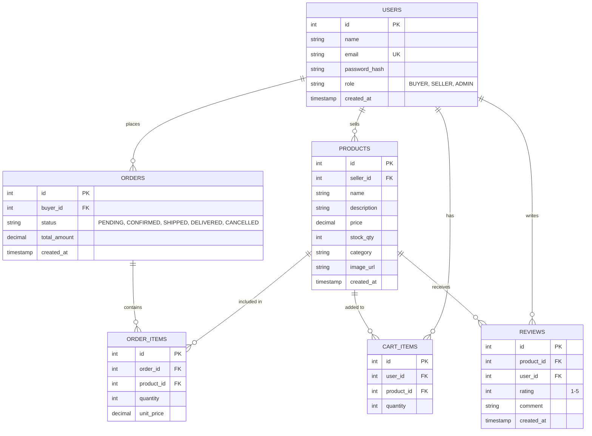
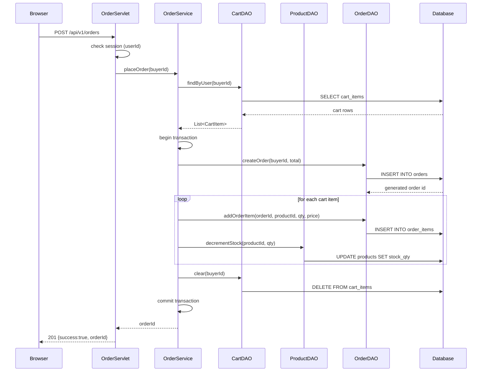

# BlueMart — Required Design Diagrams

## D1. ER Diagram

```mermaid
erDiagram
    USERS ||--o{ PRODUCTS : sells
    USERS ||--o{ ORDERS : places
    USERS ||--o{ CART_ITEMS : has
    USERS ||--o{ REVIEWS : writes
    PRODUCTS ||--o{ ORDER_ITEMS : "included in"
    PRODUCTS ||--o{ CART_ITEMS : "added to"
    PRODUCTS ||--o{ REVIEWS : receives
    ORDERS ||--o{ ORDER_ITEMS : contains

    USERS {
        int id PK
        string name
        string email UK
        string password_hash
        string role "BUYER, SELLER, ADMIN"
        timestamp created_at
    }
    PRODUCTS {
        int id PK
        int seller_id FK
        string name
        string description
        decimal price
        int stock_qty
        string category
        string image_url
        timestamp created_at
    }
    ORDERS {
        int id PK
        int buyer_id FK
        string status "PENDING, CONFIRMED, SHIPPED, DELIVERED, CANCELLED"
        decimal total_amount
        timestamp created_at
    }
    ORDER_ITEMS {
        int id PK
        int order_id FK
        int product_id FK
        int quantity
        decimal unit_price
    }
    CART_ITEMS {
        int id PK
        int user_id FK
        int product_id FK
        int quantity
    }
    REVIEWS {
        int id PK
        int product_id FK
        int user_id FK
        int rating "1-5"
        string comment
        timestamp created_at
    }
```

## D2. Use Case Diagram

```mermaid
graph TD
    Buyer([Buyer])
    Seller([Seller])
    Admin([Admin])

    Buyer --> UC1[Register / Login]
    Buyer --> UC2[Browse / Search Products]
    Buyer --> UC3[Add to Cart]
    Buyer --> UC4[Update / Remove Cart Items]
    Buyer --> UC5[Place Order]
    Buyer --> UC6[View Order History]
    Buyer --> UC7[Leave Product Review]

    Seller --> UC1
    Seller --> UC8[Create Product Listing]
    Seller --> UC9[Edit / Delete Listing]
    Seller --> UC10[View Incoming Orders]
    Seller --> UC11[Update Order Status]

    Admin --> UC1
    Admin --> UC12[View All Users]
    Admin --> UC13[View All Orders]
    Admin --> UC14[Moderate / Remove Listings]
```

## D3. Sequence Diagram — Place Order Flow

```mermaid
sequenceDiagram
    participant Browser
    participant OrderServlet
    participant OrderService
    participant CartDAO
    participant ProductDAO
    participant OrderDAO
    participant Database

    Browser->>OrderServlet: POST /api/v1/orders
    OrderServlet->>OrderServlet: check session (userId)
    OrderServlet->>OrderService: placeOrder(buyerId)
    OrderService->>CartDAO: findByUser(buyerId)
    CartDAO->>Database: SELECT cart_items
    Database-->>CartDAO: cart rows
    CartDAO-->>OrderService: List<CartItem>

    OrderService->>OrderService: begin transaction
    OrderService->>OrderDAO: createOrder(buyerId, total)
    OrderDAO->>Database: INSERT INTO orders
    Database-->>OrderDAO: generated order id

    loop for each cart item
        OrderService->>OrderDAO: addOrderItem(orderId, productId, qty, price)
        OrderDAO->>Database: INSERT INTO order_items
        OrderService->>ProductDAO: decrementStock(productId, qty)
        ProductDAO->>Database: UPDATE products SET stock_qty
    end

    OrderService->>CartDAO: clear(buyerId)
    CartDAO->>Database: DELETE FROM cart_items
    OrderService->>OrderService: commit transaction

    OrderService-->>OrderServlet: orderId
    OrderServlet-->>Browser: 201 {success:true, orderId}
```